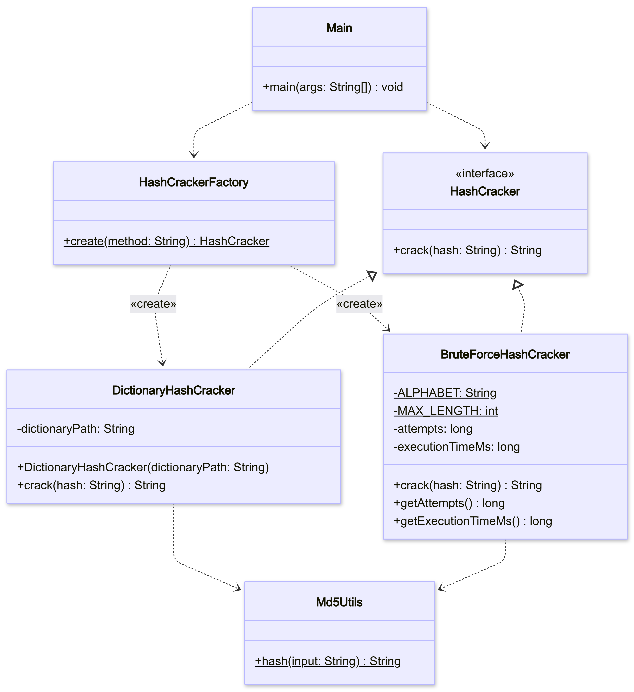

# PasswordCracker v1

Outil en ligne de commande permettant de retrouver un mot de passe à partir de son
empreinte MD5, via une attaque par dictionnaire ou par force brute. Ce projet illustre
la mise en œuvre du patron de création **Simple Factory**.

## Table des matières
1. [Introduction](#1-introduction)
2. [Présentation du problème](#2-présentation-du-problème)
3. [Architecture](#3-architecture)
4. [Diagramme UML](#4-diagramme-uml)
5. [Usage du patron Simple Factory](#5-usage-du-patron-simple-factory)
6. [Résultats obtenus](#6-résultats-obtenus)
7. [Difficultés rencontrées](#7-difficultés-rencontrées)
8. [Conclusion](#8-conclusion)

---

## 1. Introduction

Dans le domaine de la cybersécurité, les mots de passe ne sont généralement pas
stockés en clair : ils sont transformés à l'aide de fonctions de hachage
cryptographiques comme MD5. Lors d'un audit de sécurité, il est souvent nécessaire de
vérifier la robustesse des mots de passe utilisés en tentant de retrouver le mot de
passe original à partir de son empreinte.

Ce mini-projet propose une première version de **PasswordCracker**, un outil en ligne
de commande capable de retrouver un mot de passe à partir de son hash MD5, en utilisant
soit une attaque par dictionnaire, soit une attaque par force brute. Cette version est
conçue autour du patron de création **Simple Factory**.

## 2. Présentation du problème

Étant donné un hash MD5, l'objectif est de retrouver le mot de passe en clair qui lui
correspond, à l'aide de deux stratégies :

- **Attaque par dictionnaire (`DICO`)** : le programme parcourt une liste de mots
  connus, calcule le hash MD5 de chacun, et le compare au hash recherché.
- **Attaque par force brute (`BRUTE`)** : le programme génère automatiquement toutes
  les combinaisons possibles à partir de l'alphabet `a-z`, jusqu'à une longueur
  maximale de 4 caractères, et teste chacune jusqu'à trouver une correspondance.

Le programme reçoit en argument une méthode de cassage et un hash MD5, et affiche le
mot de passe trouvé, ou un message d'échec si aucune correspondance n'est obtenue.

## 3. Architecture

L'application repose sur le patron de création **Simple Factory**, qui centralise
l'instanciation des différentes stratégies de cassage de mot de passe.

L'interface `HashCracker` définit un contrat unique — la méthode `crack(String hash)`
— que toute stratégie de cassage doit respecter. Deux implémentations concrètes
réalisent ce contrat : `DictionaryHashCracker` (attaque par dictionnaire) et
`BruteForceHashCracker` (attaque par force brute).

La classe `HashCrackerFactory` est l'unique point d'entrée pour obtenir une instance
de stratégie : elle reçoit une méthode (`"BRUTE"` ou `"DICO"`) et retourne
l'implémentation correspondante, sans jamais exposer les classes concrètes au reste
de l'application. Le programme principal (`Main`) ne connaît que l'interface
`HashCracker` : il ne manipule jamais directement `DictionaryHashCracker` ou
`BruteForceHashCracker`.

Cette architecture permet le **polymorphisme** : `Main` appelle `cracker.crack(hash)`
sans savoir quelle implémentation s'exécute réellement derrière l'interface.

### Responsabilités des classes

- **`HashCracker`** *(interface)* — Définit le contrat commun à toute stratégie de
  cassage de mot de passe. Une seule méthode : `crack(String hash) : String`, qui
  retourne le mot de passe trouvé ou `null` si aucune correspondance n'est obtenue.
- **`DictionaryHashCracker`** — Charge une liste de mots depuis un fichier, calcule le
  hash MD5 de chaque mot, et le compare au hash recherché jusqu'à trouver une
  correspondance ou épuiser la liste.
- **`BruteForceHashCracker`** — Génère automatiquement toutes les combinaisons
  possibles à partir de l'alphabet `a-z` (longueur max. 4), et teste chacune jusqu'à
  trouver une correspondance.
- **`HashCrackerFactory`** — Fabrique statique responsable de la création des objets
  `HashCracker`. Centralise toute la logique de création : aucune classe concrète
  n'est instanciée ailleurs dans le programme.
- **`Md5Utils`** — Classe utilitaire partagée responsable du calcul du hash MD5,
  utilisée par les deux stratégies pour éviter toute duplication de code.
- **`Main`** — Point d'entrée de l'application console. Parse les arguments `-m`
  (méthode) et `-h` (hash), délègue la création de la stratégie à
  `HashCrackerFactory`, puis affiche le résultat.

## 4. Diagramme UML



## 5. Usage du patron Simple Factory

Le patron **Simple Factory** est utilisé pour centraliser la création des objets
`HashCracker` dans une unique classe, `HashCrackerFactory`. Le programme principal ne
crée jamais directement une instance de `DictionaryHashCracker` ou
`BruteForceHashCracker` : il demande à la fabrique de le faire à sa place, en lui
passant simplement le nom de la méthode souhaitée.

```java
HashCracker cracker = HashCrackerFactory.create("DICO");
String password = cracker.crack("e7247759c1633c0f9f1485f3690294a9");
```

Grâce au polymorphisme, le code appelant utilise toujours l'interface `HashCracker`,
sans jamais connaître la classe concrète réellement instanciée.

### Exemples d'exécution

```bash
passwordCracker -m BRUTE -h e7247759c1633c0f9f1485f3690294a9
passwordCracker -m DICO -h e7247759c1633c0f9f1485f3690294a9
```

Résultat attendu :

Password found: test

ou

Password not found

